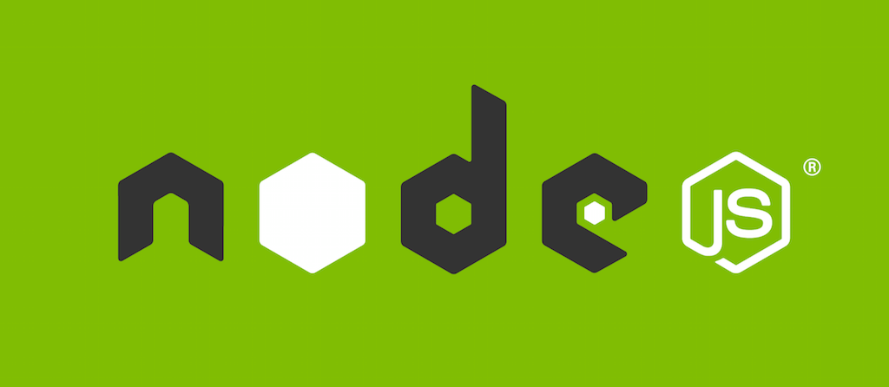

# Deploy on the Cloud
This repository contains step-by-step guide for deploying any application to IaaS or PaaS

**Want to Deploy Django App?** [Click Here](./django/guide.md)
**No, I am a NodeJS Fan Boy.** [Click Here](./nodejs/guide.md)
