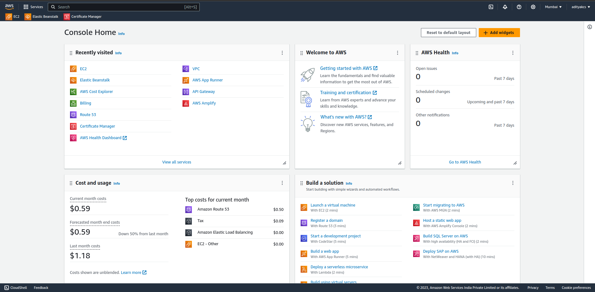
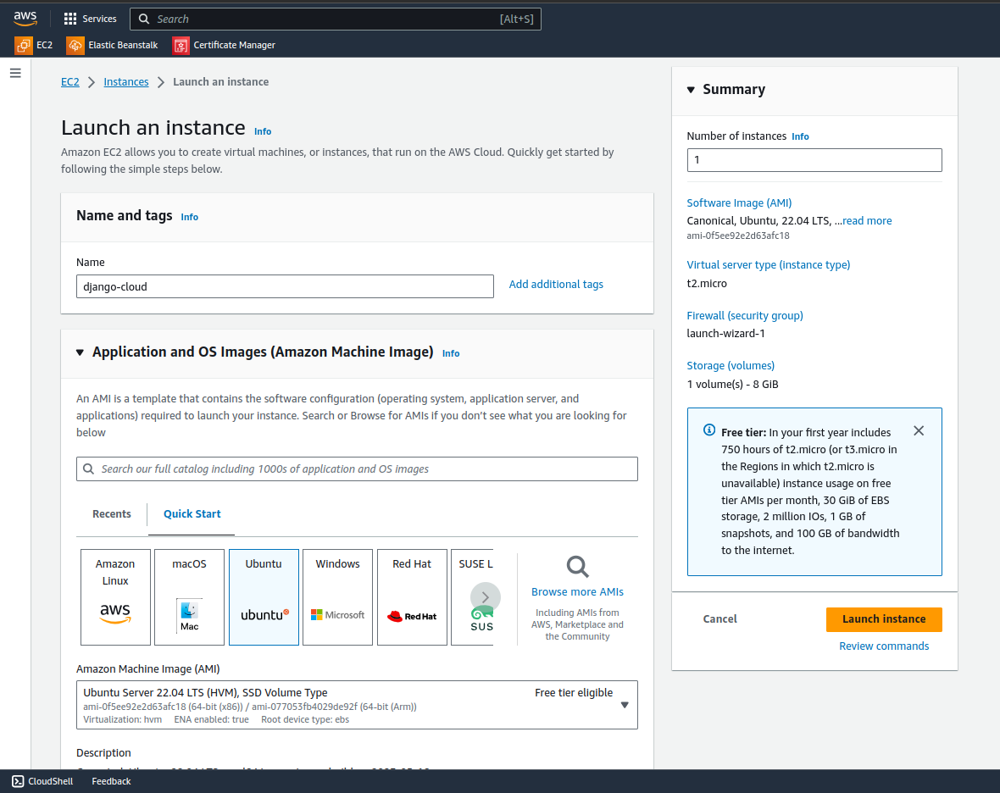
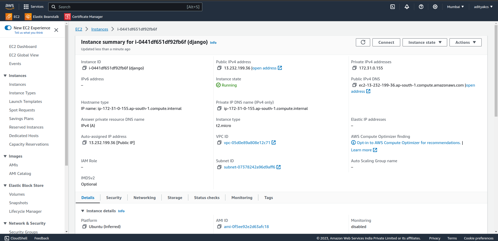
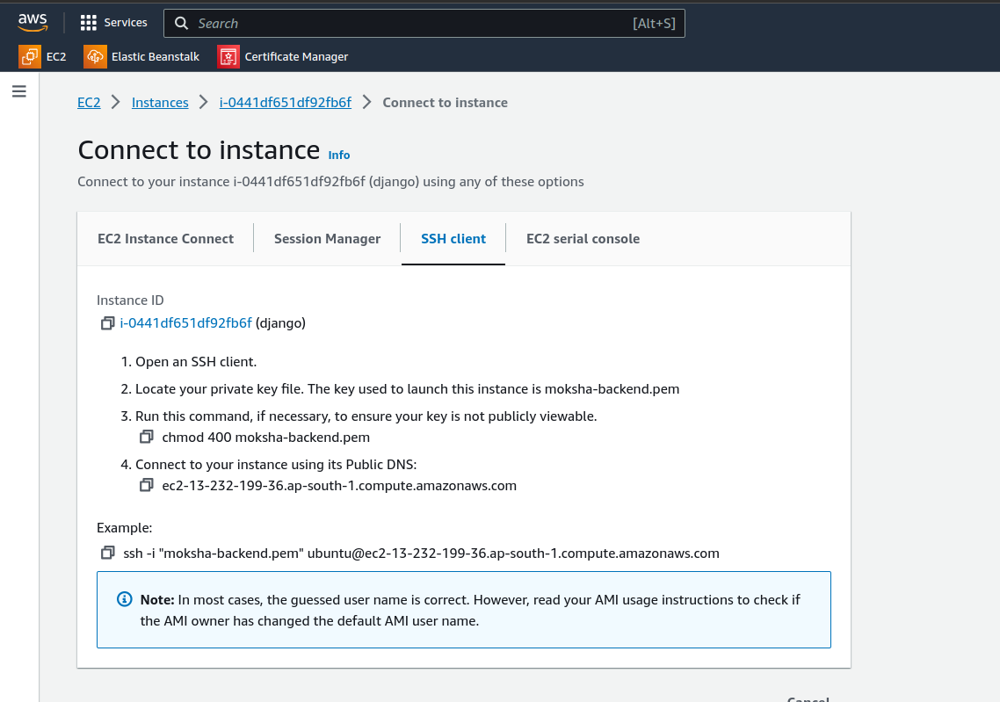
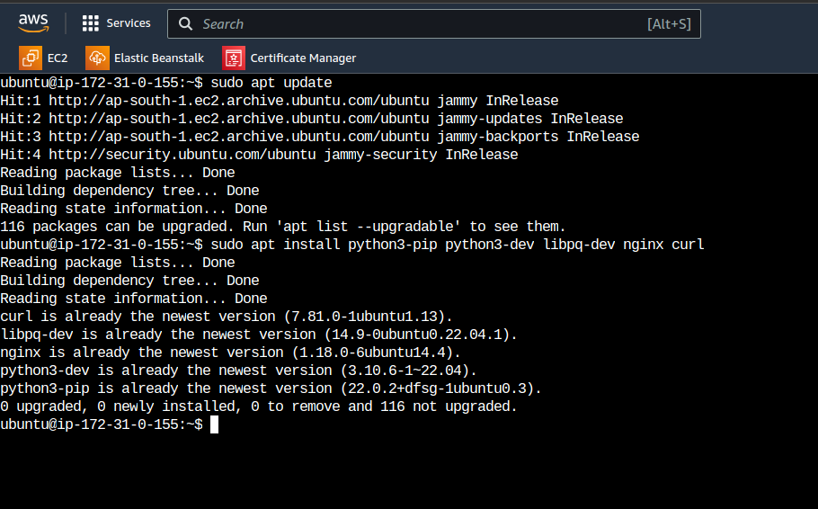
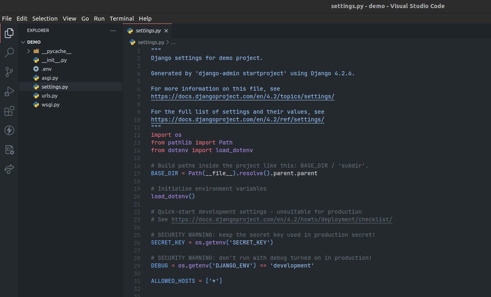
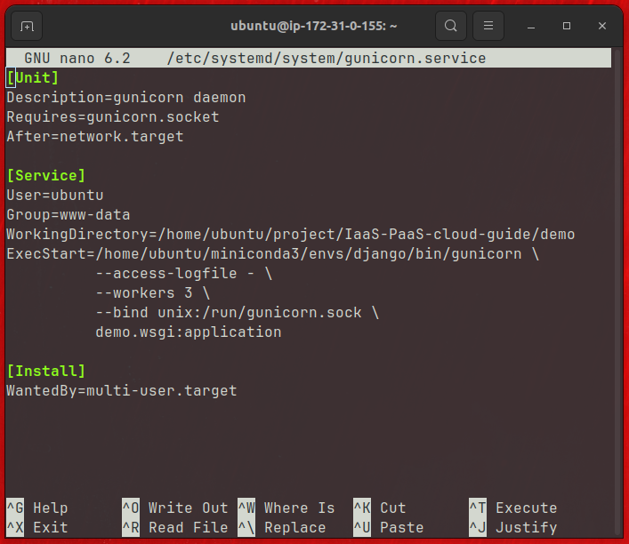
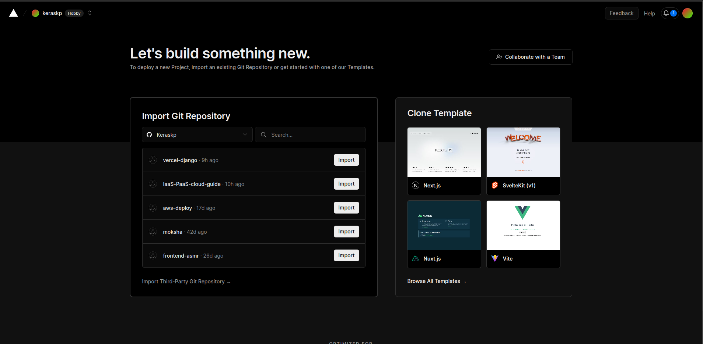
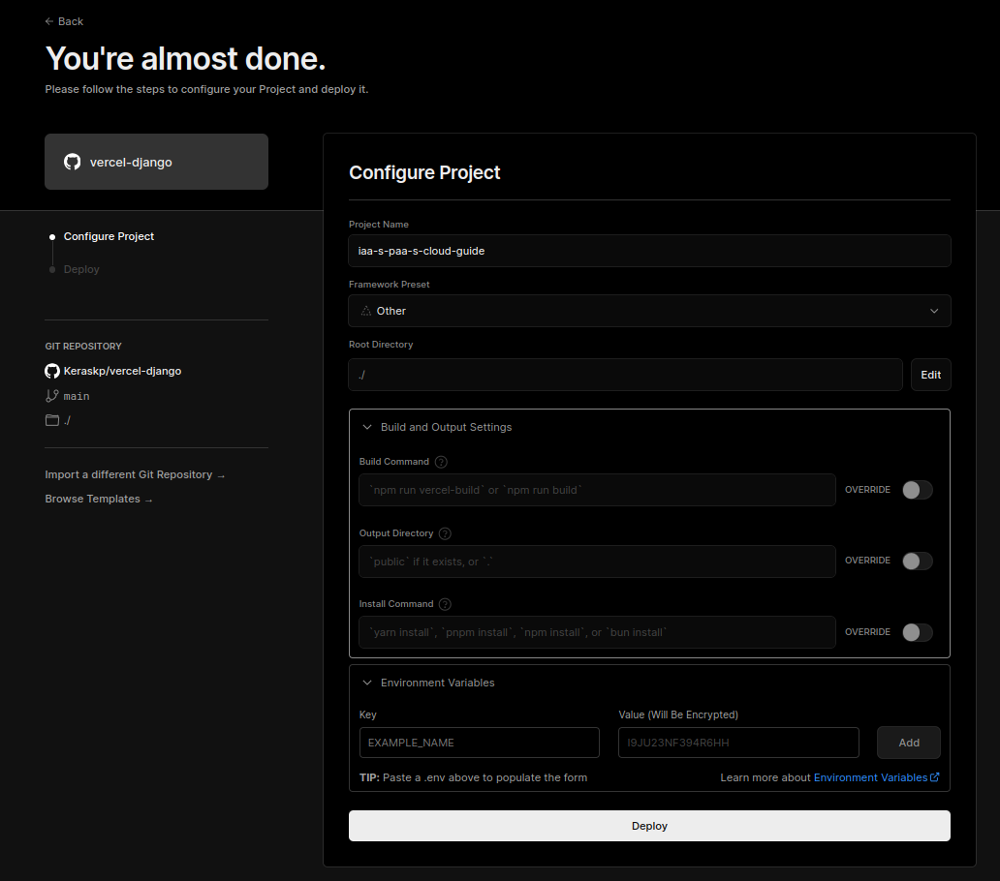
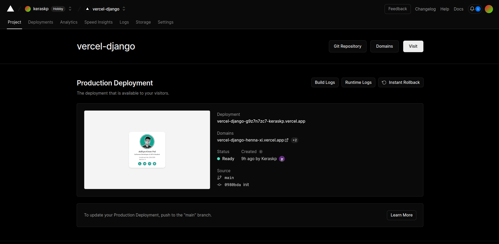

## Deploying a Django Project on AWS EC2 Instance (IaaS)
Steps for deploying a Django project on an Amazon EC2 instance involves several steps:

**Deployment link:** [http://ec2-13-232-199-36.ap-south-1.compute.amazonaws.com](http://ec2-13-232-199-36.ap-south-1.compute.amazonaws.com)

1. **Set Up an EC2 Instance**:
   - Log in to your AWS Management Console.



   - Launch an EC2 instance. Choose an Ubuntu 22.04 and select the instance that suits your needs. AWS offer t2.micro in its free tier.



   - Configure security groups to allow traffic on the necessary ports (e.g., 80 for HTTP, 443 for HTTPS, and SSH for remote access).



2. **Connect to Your EC2 Instance**:
   - Use SSH to connect to your EC2 instance using the private key associated with the instance.
        ```bash
        ssh -i /path/to/your/key.pem ec2-user@your-instance-ip
        ```


3. **Update and Install Software**:
   - Update the package manager on the instance:

        ```bash
        sudo apt update
        sudo apt install python3-pip python3-dev libpq-dev nginx curl
        ```

- Install required software, such as Python, pip, nginx and Git, depending on your project's needs.


4. **Clone Your Django Project**:
   - Use Git to clone your Django project repository onto the EC2 instance.

5. **Set Up a Virtual Environment**:
   - Create a virtual environment to isolate your project's dependencies:
        ```bash
        python3 -m venv myenv
        source myenv/bin/activate
        ```

6. **Install Dependencies**:
   - Navigate to your project directory and install Python dependencies using `pip`:
        ```bash
        pip install -r requirements.txt
        ```

7. **Configure Database and Environment Variables**:
   - Configure your database settings in your Django project's settings.py.
   - Set environment variables for sensitive information (e.g., secret keys, database credentials) using a `.env` file or AWS Parameter Store.

   


8. **Collect Static Files, Migrate the Database and Run Development Server**:
   - Run the following Django management commands:
        ```bash
        python manage.py collectstatic
        python manage.py migrate
        python manage.py runserver
        ```
9. **Configure Gunicorn or uWSGI**:
    - Install and configure Gunicorn or uWSGI to serve your Django application. Make sure it's running as a systemd service to ensure it starts automatically after a server reboot.

    

    - We can now start and enable the Gunicorn socket. This will create the socket file at `/run/gunicorn.sock` now and at boot. When a connection is made to that socket, systemd will automatically start the gunicorn.service to handle it:


        ```bash
        sudo systemctl start gunicorn.socket
        sudo systemctl enable gunicorn.socket
        ```

10. **Configure a Web Server (e.g., Nginx or Apache)**:
   - Install and configure a web server to serve your Django application. You'll need to set up proxy settings to pass requests to your Django application server (e.g., Gunicorn or uWSGI).
   - Configure your web server (e.g., Nginx or Apache) to act as a reverse proxy, forwarding incoming HTTP requests to Gunicorn or uWSGI.

        ```bash
        sudo nano /etc/nginx/sites-available/django
        ```
- /etc/nginx/sites-available/django:
   
   ```nginx
   server {
    listen 80;
    server_name SERVER_IP;

    location = /favicon.ico { access_log off; log_not_found off; }

    location / {
        include proxy_params;
        proxy_pass http://unix:/run/gunicorn.sock;
        }

   }
   ```
- Now, we can enable the file by linking it to the sites-enabled directory:

   ```bash
   sudo ln -s /etc/nginx/sites-available/django /etc/nginx/sites-enabled
   ```
- Allow requests from your required port or IP:
    ```bash
    sudo ufw allow 'Nginx Full'
    ```


12. **Set Up Domain and SSL (Optional)**:
    - Configure your domain's DNS settings to point to your EC2 instance's IP address.
    - Obtain and install an SSL/TLS certificate (e.g., Let's Encrypt) to enable HTTPS.

13. **Scaling and Load Balancing (Optional)**:
    - As your traffic grows, consider setting up load balancing and auto-scaling to ensure high availability and performance.


#### Preview of Deployment:


---

## Deploying a Django Project on any PaaS provider

Unlike a IaaS service, PaaS services provides compute, storage, networking, environment and a secured domain out of the box. Deploying a PaaS service is much simpler than a IaaS service. The following guide shows how a Django project 
is deployed on [vercel.com](https://vercel.com).

Link to Deployment: [https://vercel-django-henna-xi.vercel.app](https://vercel-django-henna-xi.vercel.app)

Steps for deploying a Django project on any PaaS Provider involves these steps:

1. **Create an Account in any of the PaaS Providers**:

   - Connect your github account with Vercel and select the project you want to deploy.




2. **Add corresponding deployment files to your project**:

   - Go through the docs of your PaaS and add the import deployment files to your project like `vercel.json` for Vercel.
   - Other providers require a Yaml file or a Procfile
   - Specify the environment, build & run command you want in the deployment file.
   - vercel.json:

      ```json
      {
         "builds": [{
            "src": "demo/wsgi.py",
            "use": "@vercel/python",
            "config": { "maxLambdaSize": "15mb", "runtime": "python3.11" }
         }],
         "routes": [
            {
                  "src": "/(.*)",
                  "dest": "demo/wsgi.py"
            }
         ]
      }
      ```
   - commit and push the changes to your github project


3. **Deploying the project**:
   
   - Provide name to the deployment and select environment you want to deploy in.
   - Specify build and run commands. You may also add Root Directory of your project or environment variables.
   - Click on Deploy button and wait for a few mins a URL Domain will be generated.



   - Click on the domain URL of the project to view it




#### Preview of Deployment:
