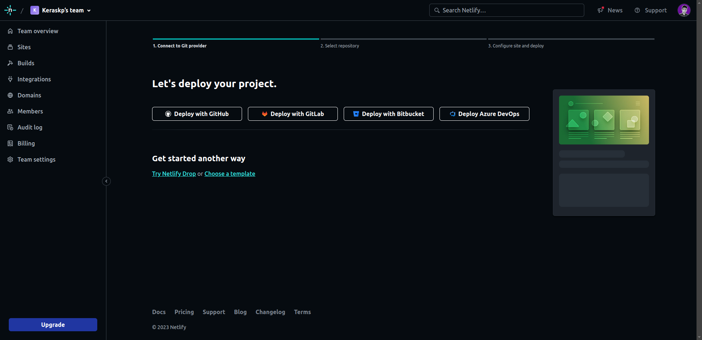
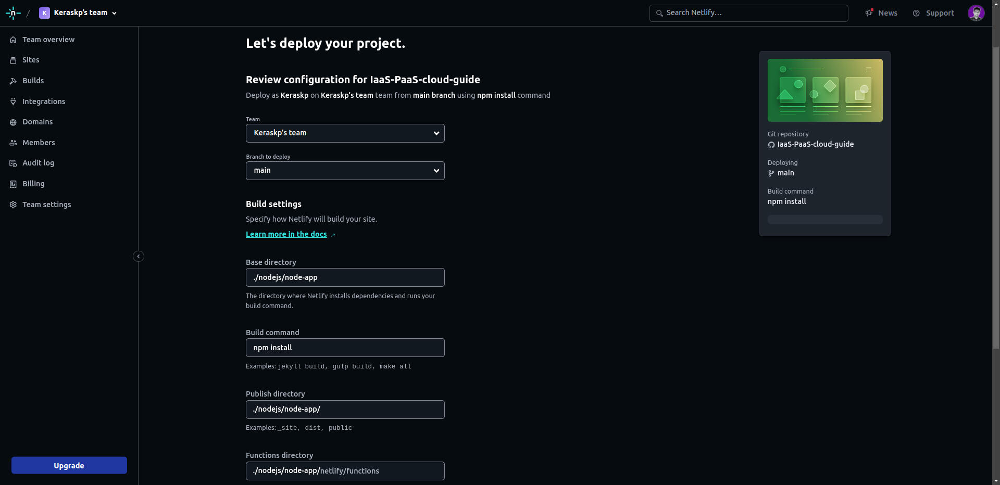
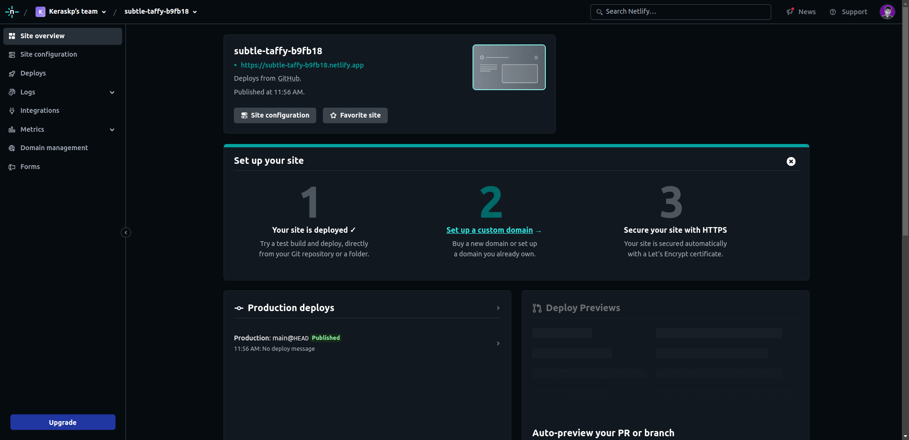

## Deploying a NodeJS application on Netlify
1. **Create your Node js application**
    - Create an npm project using the following commands
        ```bash
        mkdir projectname
        cd projectname
        npm init
        ```

    - After entering the above command npm will ask project name, main entry point, start command etc. Sample start command `start: node server.js` means you can run project with 'npm start'

2. **Initialize git repository and commit all changes to your Github**

    - You can create a repository on github and clone it to your local machine 
        ```bash
        git clone https://github.com/dummyuser/node-app.git
        ``` 

    - Add all project files to your git repository and commit the changes and push them to github.


3. **Open an account in Netlify and Authorize access to your github**

    - This step is fairly simple, you can also look it up on the internet

4. **Deploying on Netlify**
    - Select your deploy option: Deploy with Github
    

    - Select your Github repository
    

    - Specify your branch (usually `main`), directory (usually `./`), build command (depends on project, for this implementation use `npm install`)
    

    - Click on the domain URL provided by Netlify to view deployment
    